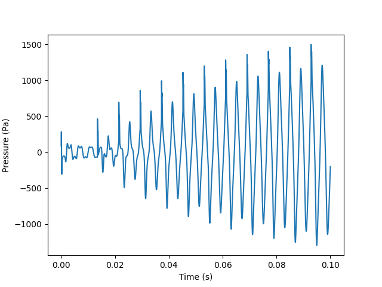

# Reduced Order model for thermoacoustic instability in Combustion chamber

Implementation of the reduced order model mentioned in the paper  "A reduced-order model for the control of thermoacoustic instabilities in a dump combustor" (https://hal.science/hal-04600500v1/document) 

### Dependencies
- numpy
- matplotlib

### Sample outputs
- u_bar = 8 m/s  
  
- u_bar = 9 m/s  
   

### References
- https://hal.science/hal-04600500v1/document
- https://www.sciencedirect.com/science/article/abs/pii/S1540748914003174
  
